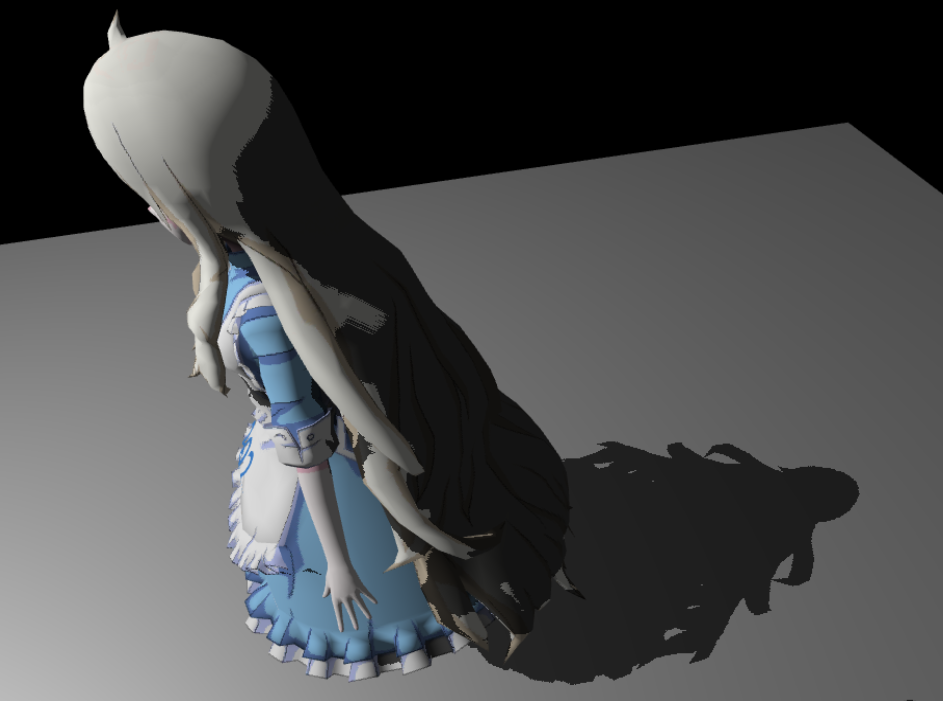
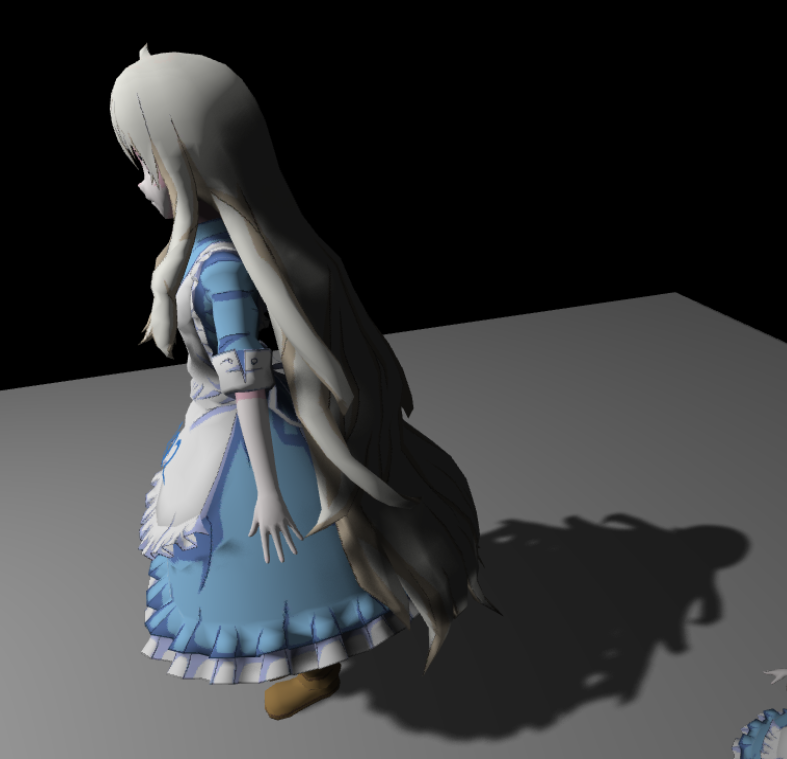
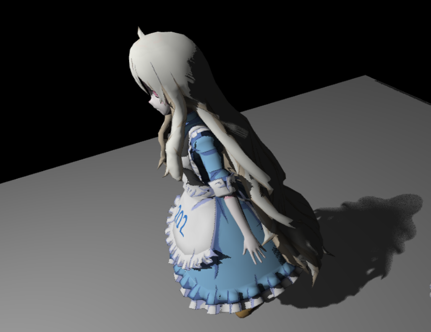

# GAMES202 Homework1 - Shadow Mapping, PCF and PCSS

## Overview

This homework implements several shadow rendering techniques introduced in GAMES202:

- Shadow Mapping
- Percentage Closer Filtering (PCF)
- Percentage Closer Soft Shadows (PCSS)
- Blocker Search
- Average Blocker Depth Estimation
- Penumbra Size Estimation
- Variable Radius Filtering

The goal is to compare hard shadows, filtered shadows, and physically-inspired soft shadows.

---

## Results

### Shadow Mapping

Hard shadows generated directly from the shadow map.



---

### Percentage Closer Filtering (PCF)

PCF reduces shadow aliasing by averaging multiple depth comparisons around the current fragment.



---

### Percentage Closer Soft Shadows (PCSS)

PCSS extends PCF by estimating the penumbra size based on blocker depth and receiver distance.

Implementation steps:

1. Blocker Search
2. Average Blocker Depth Estimation
3. Penumbra Size Estimation
4. Variable Radius PCF Filtering

This produces harder contact shadows and softer shadow boundaries as the distance from the occluder increases.



---

## Implementation

### Shadow Mapping

Render the scene from the light's point of view and store depth information into a shadow map.

### Percentage Closer Filtering (PCF)

Perform multiple depth comparisons using Poisson Disk sampling and average the results to generate smoother shadow edges.

### Percentage Closer Soft Shadows (PCSS)

#### Step 1 - Blocker Search

Search neighboring shadow map samples and compute the average blocker depth.

#### Step 2 - Penumbra Estimation

Estimate penumbra size using the distance between the receiver and the average blocker.

#### Step 3 - Variable Radius Filtering

Use the estimated penumbra size as the PCF filter radius.

---

## Usage

### For Visual Studio Code

Install plugin `Live Server` and run with `index.html` directly.

### For Node.js users

Install:

```bash
npm install http-server -g
```

Run (from the `index.html` directory):

```bash
http-server . -p 8000
```

Open:

```text
http://localhost:8000
```

---

## In-web Operation

- Hold right mouse button to rotate the camera
- Scroll mouse wheel to zoom in/out
- Hold left mouse button to move the camera
- Hold left mouse button only to drag the GUI