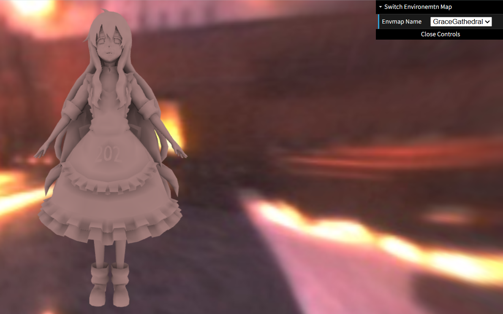
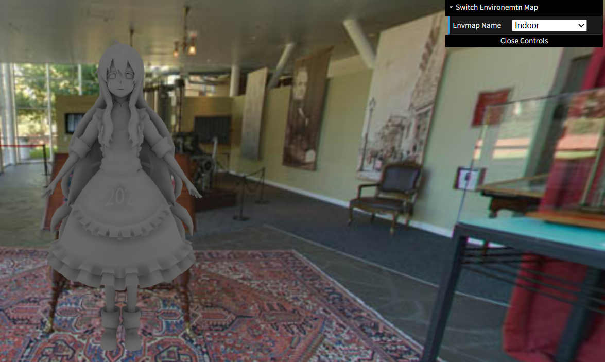
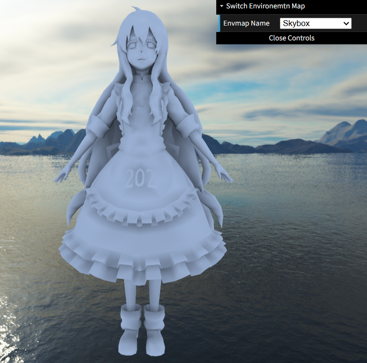
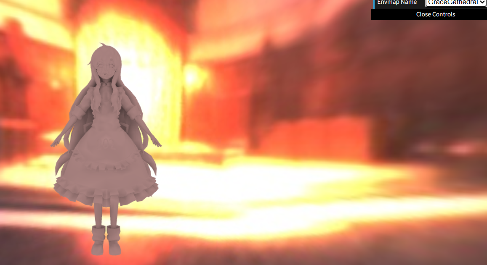
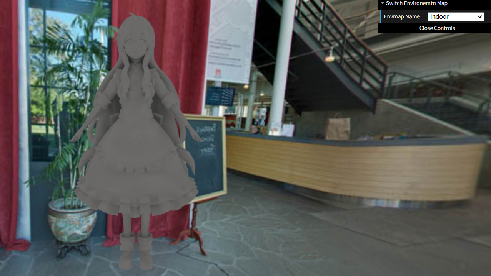
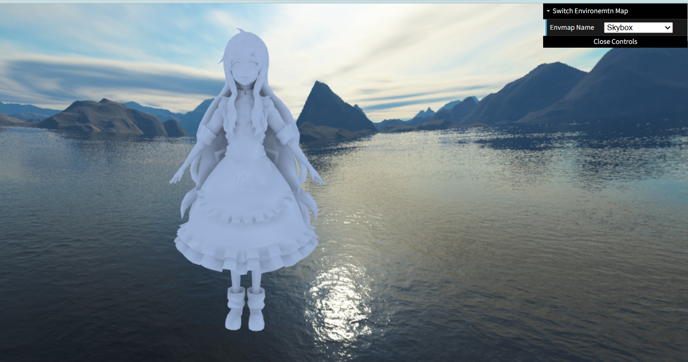

# GAMES202 Homework 2 - Precomputed Radiance Transfer

## Overview

This project implements Precomputed Radiance Transfer (PRT) with low-order Spherical Harmonics (SH) for real-time environment lighting.

Implemented features:

- Diffuse Shadowed PRT
- Multiple environment maps
- Diffuse Interreflection (Bonus 1)
- Spherical Harmonics Rotation (Bonus 2)

---

## Results

### GraceCathedral



### Indoor



### Skybox



---

## Implementation Details

### Environment Lighting Projection

The environment map is projected into 2nd-order spherical harmonics (9 coefficients).

For each cubemap texel:

1. Convert texel coordinates to a world-space direction.
2. Compute the texel solid angle.
3. Evaluate SH basis functions.
4. Accumulate radiance into SH coefficients.

The generated lighting coefficients are stored in:

```text
light.txt
```

---

### Diffuse Shadowed PRT

For each mesh vertex, the diffuse transport function is projected into spherical harmonics.

For every sampled direction:

```cpp
H = max(dot(normal, wi), 0)
```

Visibility is evaluated using ray casting.

If the ray is blocked:

```cpp
transport = 0
```

Otherwise:

```cpp
transport = H / PI
```

The resulting transport coefficients are stored in:

```text
transport.txt
```

---

### Runtime Evaluation

Each vertex stores a precomputed transport matrix:

```glsl
attribute mat3 aPrecomputeLT;
```

Lighting SH coefficients are passed as:

```glsl
uniform vec3 uPrecomputeL[9];
```

The final color is computed as:

```glsl
L = Σ (LightingSH × TransportSH)
```

---

## Bonus 1 - Diffuse Interreflection

One-bounce diffuse indirect lighting is precomputed.

For each sampled direction:

1. Trace a ray from the current vertex.
2. Intersect the mesh.
3. Interpolate the hit point transport SH coefficients.
4. Accumulate indirect transport.

The final transport is:

```cpp
Transport = DirectTransport + IndirectTransport
```

### GraceCathedral



### Indoor



### Skybox



---

## Bonus 2 - SH Rotation

SH lighting coefficients are rotated together with the environment map.

Implementation steps:

1. Rotate sample directions using the environment rotation matrix.
2. Evaluate the original SH lighting on the rotated directions.
3. Re-project the rotated lighting back into SH coefficients.
4. Upload the rotated coefficients to the shader every frame.

```js
uPrecomputeL[0]
...
uPrecomputeL[8]
```

CornellBox is used to validate SH rotation because the red and green walls provide strong directional lighting.

### CornellBox Rotation


---

## Environment Maps

- GraceCathedral
- Indoor
- Skybox
- CornellBox