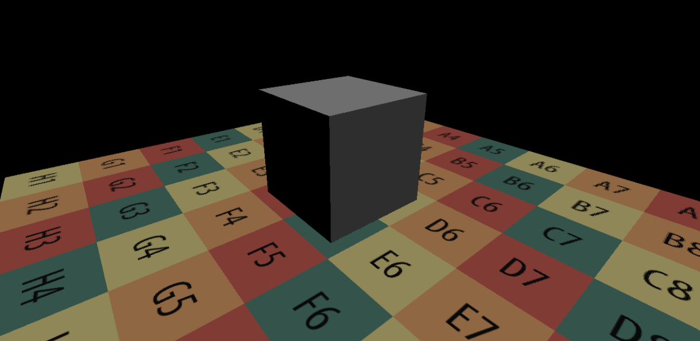
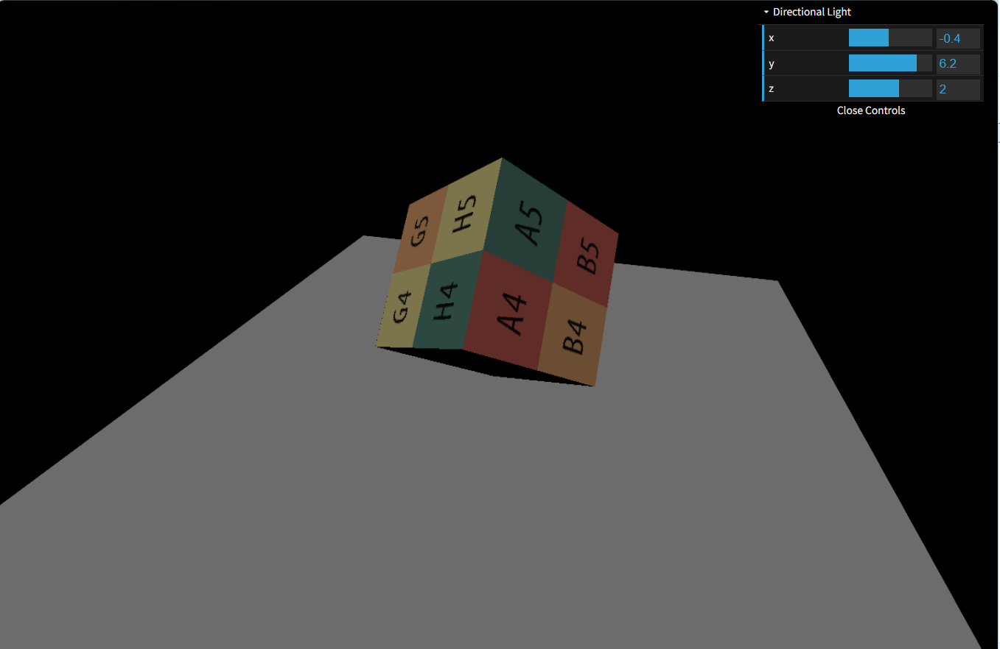
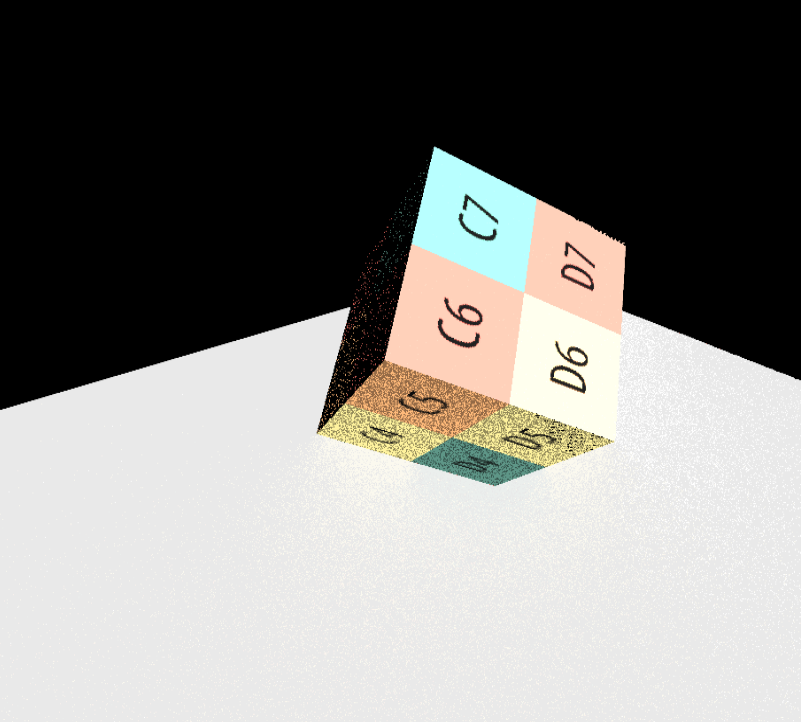
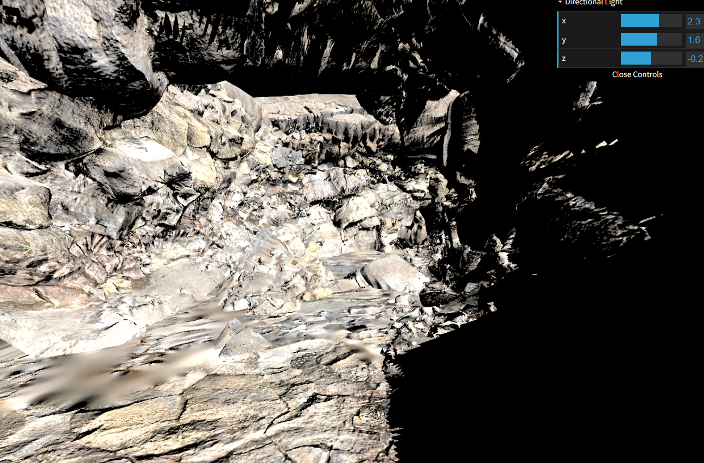
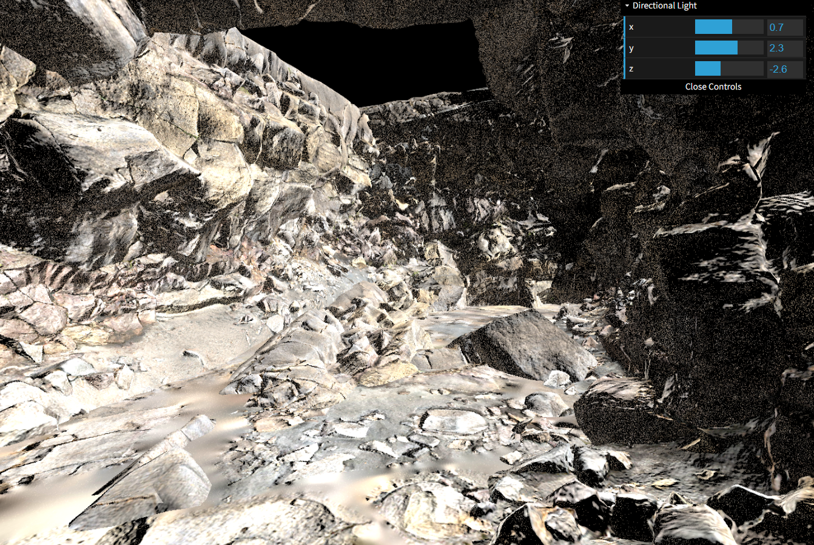

# GAMES202 Homework 3

## Overview

This homework implements **Screen Space Global Illumination (SSGI)** based on GBuffer and Screen Space Ray Tracing.

The renderer estimates indirect illumination by sampling the hemisphere around each visible surface point, tracing rays in screen space, and evaluating the lighting contribution from the first visible intersection.

An additional adaptive ray marching strategy with binary refinement was implemented as the bonus optimization to improve ray traversal efficiency and intersection accuracy.

---

## Features

### Direct Lighting

- Lambertian BRDF
- Directional light evaluation
- Shadow visibility from shadow map
- Gamma correction

---

### Screen Space Ray Marching

- World-space ray generation
- Screen-space projection
- GBuffer depth comparison
- Fixed-step ray marching
- Accurate hit position reconstruction

---

### Screen Space Indirect Illumination

- Cosine-weighted hemisphere sampling
- Local tangent space construction
- Monte Carlo indirect lighting estimation
- Diffuse global illumination
- GBuffer lighting evaluation

---

### Bonus

Implemented an adaptive hierarchical-style ray marching algorithm.

Compared with the basic fixed-step traversal, the optimized version:

- Uses larger initial ray marching steps to skip empty space.
- Refines the traversal by progressively reducing the marching step near potential intersections.
- Performs binary refinement to obtain a more accurate hit position.
- Produces more stable screen-space intersections while reducing unnecessary ray marching iterations.

Although this is not a full Hi-Z depth pyramid implementation, it follows the same coarse-to-fine traversal strategy commonly used in hierarchical screen-space ray tracing.

---

## Result

### Direct Lighting

---

### Screen Space Indirect Lighting

---

### Cave Scene

---

## Techniques

- Deferred Rendering
- GBuffer
- Screen Space Ray Tracing (SSR)
- Screen Space Global Illumination (SSGI)
- Monte Carlo Integration
- Cosine-weighted Hemisphere Sampling
- Lambert BRDF
- Adaptive Hierarchical Ray Marching
- Binary Search Refinement

---

## References

- GAMES202: Real-Time High Quality Rendering
- Screen Space Global Illumination
- Screen Space Ray Tracing