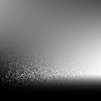
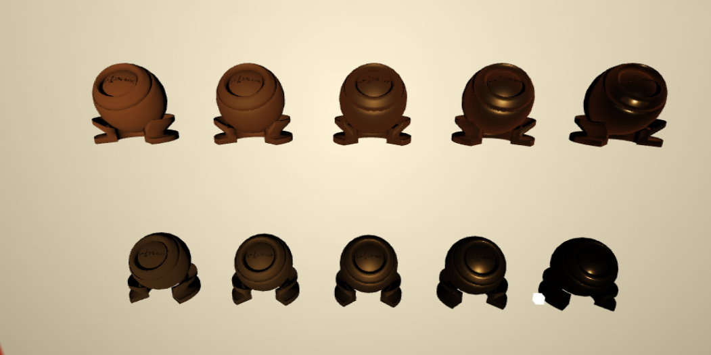

# Homework 4 - Kulla-Conty BRDF (GAMES202)

Implementation of the **Kulla-Conty Multiple-Scattering BRDF** from GAMES202.

This project implements both the **offline precomputation** and the **real-time rendering** stages, including Monte Carlo integration, GGX Importance Sampling, and Kulla-Conty energy compensation.

---

## Features

### Offline Precomputation

- Monte Carlo estimation of **E(μ)**
- GGX Importance Sampling estimation of **E(μ)**
- Precomputation of **Eavg**
- Generated lookup tables (LUTs):
  - `GGX_E_MC_LUT.png`
  - `GGX_E_LUT.png`
  - `GGX_Eavg_LUT.png`

---

### Real-time Rendering

Implemented Cook-Torrance Microfacet BRDF including

- GGX Normal Distribution Function (NDF)
- Smith Geometry Function
- Schlick Fresnel Approximation

Implemented **Kulla-Conty Multiple Scattering Compensation**

- GGX BRDF LUT lookup
- Eavg LUT lookup
- Multiple-scattering energy compensation
- Comparison between standard Cook-Torrance BRDF and Kulla-Conty BRDF

---

## Results

### Precomputed Lookup Tables

| Emu (Importance Sampling) | Emu (Monte Carlo) |
| :-----------------------: | :---------------: |
|  |  |

| Eavg (Importance Sampling) | Eavg (Monte Carlo) |
| :-----------------------: | :----------------: |
|  |  |

---

### Rendering Comparison

Top:
**Kulla-Conty BRDF**

Bottom:
**Standard Cook-Torrance BRDF**

The multiple-scattering compensation restores the energy loss of rough metallic surfaces, making high-roughness materials noticeably brighter while preserving the appearance of smooth surfaces.

---

## Techniques

- Monte Carlo Integration
- GGX Importance Sampling
- Cook-Torrance BRDF
- GGX NDF
- Smith Geometry Function
- Schlick Fresnel
- Kulla-Conty Multiple Scattering
- Lookup Table (LUT) Precomputation
- WebGL GLSL Shader Programming

---

## Course

GAMES202 – Real-Time High Quality Rendering